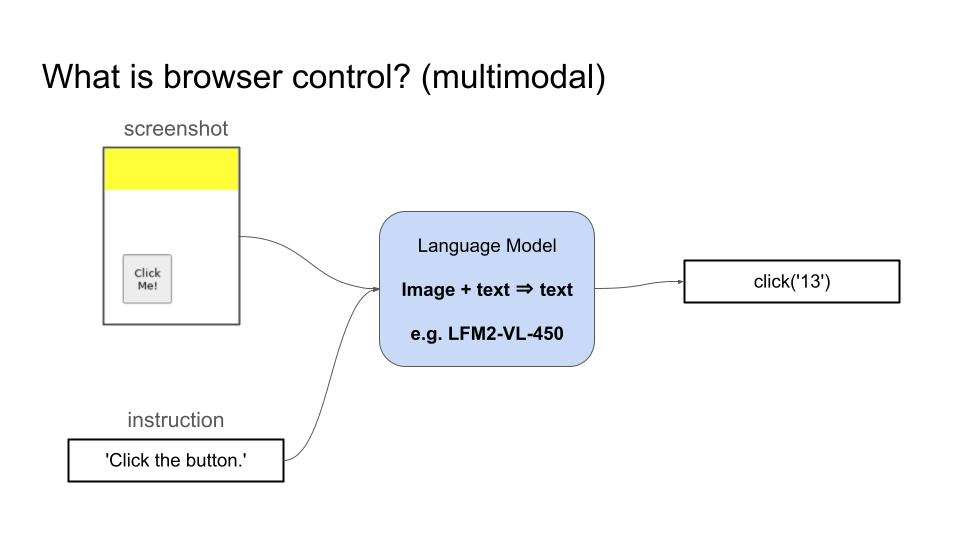
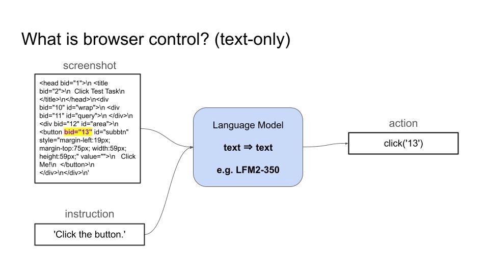
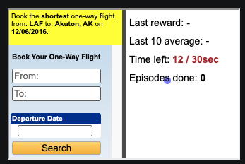
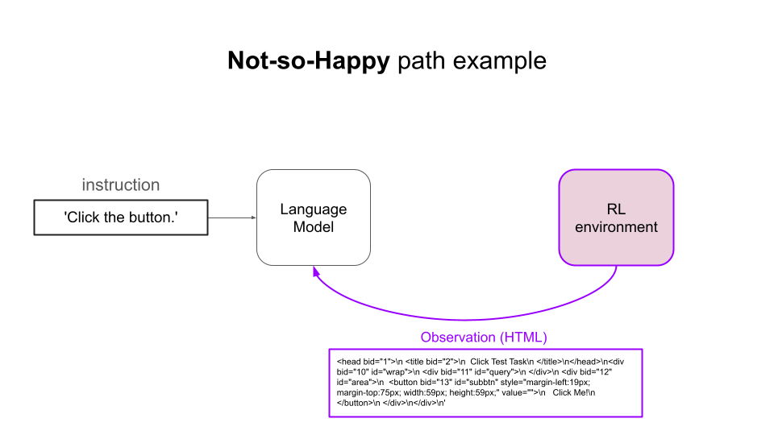
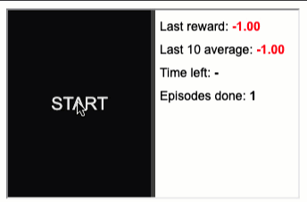
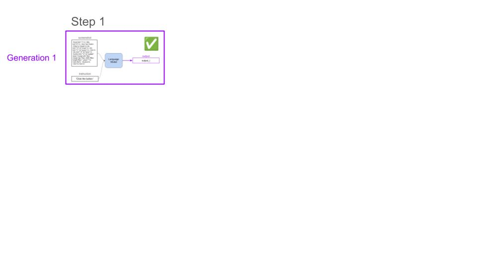
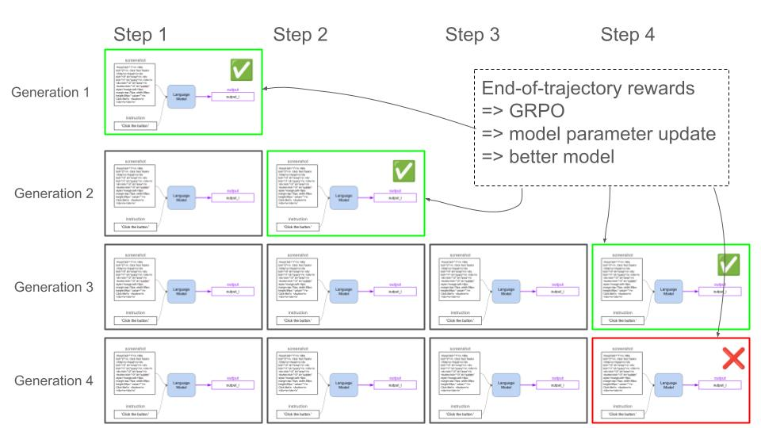
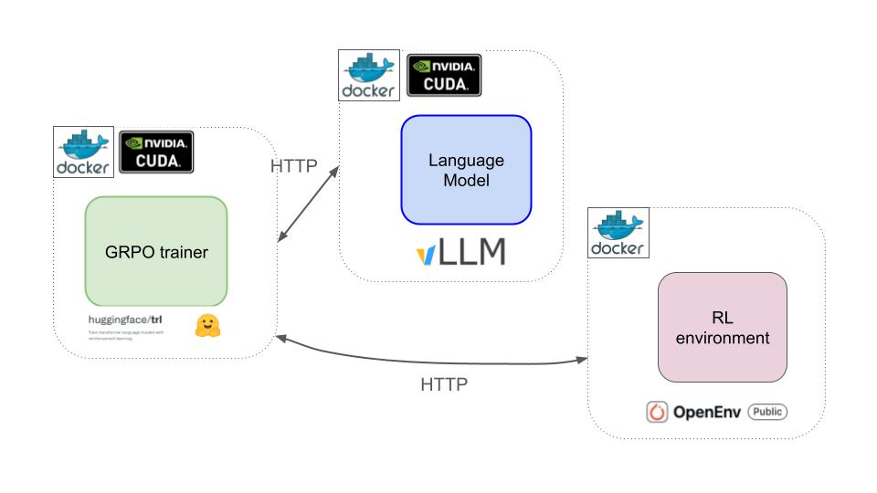
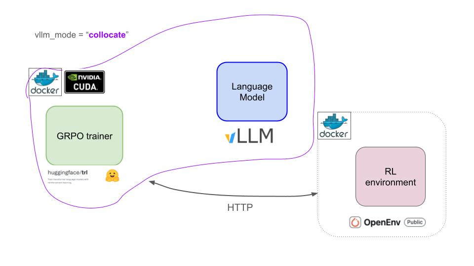

# Fine-tuning LFM2-350M for browser control with GRPO and OpenEnv

[](https://discord.gg/DFU3WQeaYD)

### Table of contents
- [What is browser control?](#what-is-browser-control)
- [Real-world use cases](#real-world-use-cases)
- [Why do we need Reinforcement Learning (RL)?](#why-do-we-need-reinforcement-learning-rl)
  - [Example](#example)
- [Building blocks of an RL training framework](#building-blocks-of-an-rl-training-framework)
  - [1. The environment -> BrowserGym via OpenEnv](#1-the-environment---browsergym-via-openenv)
  - [2. The RL algorithm -> GRPO](#2-the-rl-algorithm---grpo)
  - [3. The policy -> LFM2-350M](#3-the-policy---lfm2-350m)
- [Architecture](#architecture)
- [How to train](#how-to-train)
- [Experiments](#experiments)
  - [Full-fine tune](#full-fine-tune)
  - [Parameter efficient fine-tune with LoRA](#parameter-efficient-fine-tune-with-lora)
- [Next steps](#next-steps)


## What is browser control?

Browser control is the ability of a language model to navigate and interact with websites by generating sequences of actions (clicking elements, typing text, scrolling) to accomplish user-specified tasks like booking flights, filling forms, or extracting information from web pages.

For example:

- A Vision Language Model (VLM) can take as inputs a screenshot and the user goal, and generates a sequence of actions to accomplish that goal.

    

- A text-only Language Model can take as input the HTML code of the page and proceeds in the same way.

    

## Real-world use cases
Browser control has many real-world applications including good ones like

- **Accessibility assistance**: A screen reader companion that navigates complex checkout flows, reads product descriptions, and completes purchases for visually impaired users on Amazon or grocery delivery sites

- **Healthcare appointment management**: An app that checks multiple clinic websites for appointment availability, books the earliest slot matching your insurance, and adds it to your calendar

- **Bill payment automation**: A monthly routine that visits utility company websites, verifies amounts, and schedules payments from your bank account

However, as any other powerful technology it can also be misused to produce harmful software. For example

- **Review manipulation**: Bots that create fake accounts and post fraudulent reviews on Amazon, Yelp, or Google to artificially boost product ratings or damage competitors

Understanding how these systems are trained and deployed is crucial if we want to get the most out of the good uses, and minimize the impact of the bad use cases.


## Why do we need Reinforcement Learning (RL)?

In browser control, there are often multiple valid ways to accomplish a goal. Verifying if the Language Model has solved the task (RL with verifiable rewards is way easier/cheaper/faster than collecting a sufficiently large and diverse set of (input, output) examples to do Supervised Fine Tuning.

### Example
Task: "book the shortest one-way flight from LAF to Akuton, AK on 12/06/2016"



There are many possible ways to solve this problem, from human-like happy paths where the agent fills in the "From" field, then the "To" field and then the date, to cases where the agent mistypes LAT, then correct and then continues until completion.

Getting expert demonstrations for all these cases for Supervised Fine Tuning (SFT) is impractical. On the other hand, an RL environment that verifies at each step if the task is complete provides a sparse feedback (aka reward) that an RL algorithm can use to iteratively improve the model performance.

Moreover, with RL the Language Model can also learn to course-correct when things go wrong. If they click the wrong element or navigate to an unexpected page, they can backtrack and find an alternative path. SFT models trained only on successful demonstrations often get stuck when they deviate from the expected trajectory

This is why we use RL and not SFT for this task. Having said this, you can use SFT to warm-up the model, and then RL to boost performance.


## Building blocks of an RL training framework

The idea of RL is to iteratively let the Language Model (aka the policy)

- observe the **state** of the environment (e.g. DOM elements of the website)
- output an **action** (aka text completion) and,
- occasionally obtain a positive reward (aka feedback) from the environment.



By repeating this process long enough, and using a well-calibrated RL algorithm the LM will get better at this task.

Rewards for browser control tasks can be computed programatically with tools like [Playwright](https://github.com/microsoft/playwright). Playwright is and end-2-end test framework for web apps that can

- extract structure and content from the page Document object Model (DOM)
- check URLs to verify the agent landed on the desired page, or
- query databases to check the agent modified their state correctly.

### 1. The environment -> BrowserGym via OpenEnv

[OpenEnv](https://github.com/meta-pytorch/OpenEnv) is an open-source library that

- standardizes Python access to a large collection of RL environments
- simplifies deployment of RL environments as standalone **Docker containers**, that can run either locally, remotely on Kubernetes or as Hugging Face spaces.
- helps AI researchers generate and publish new RL environments.

One of the environments inside OpenEnv is [BrowserGym](https://github.com/ServiceNow/BrowserGym), which is an open-source collection of different browser automation benchmarks

- [Mini World of Bits++](https://miniwob.farama.org/) (aka MiniWoB)
- [WebArena](https://github.com/web-arena-x/webarena)
- [VisualWebArena](https://github.com/web-arena-x/visualwebarena)
- [WorkArena](https://github.com/ServiceNow/WorkArena)

MiniWoB is the easiest benchmark in BrowserGym as it contains very narrowly defined tasks. This is a great starting point for our RL adventure. Here is a sample of these tasks. You can find the complete list [here](https://miniwob.farama.org/environments/list/).


In this repo we will use an easy task from MiniWoB called `click-test`, aka learning to click a button.



It is simple enough to showcase the whole training pipeline without having to spend too much time training the model.

Feel free to choose another task from [this list](https://miniwob.farama.org/environments/list/) and burn some GPUs to hit good performance.

### 2. The RL algorithm -> GRPO

As the Language Model interacts with the environment you collect a sequence of rollouts with sparse rewards from the environment. Using these sparse rewards the RL algorithm (e.g. GRPO) adjusts the Language Model parameters to increase the chances of getting larger rewards.

Here is a sample of 4 rollouts for the same initial prompt/task, where the model

1. Solves the task in the first step
2. Solves the task in the second step
3. Solves the task in the third step
4. Does not solve the task after 4 steps, which is the max rollout length we set.



GRPO uses the relative performance within that group to determine which actions to reinforce.



Responses that perform better than their groupmates get positive advantages, while worse ones get negative advantages. This approach is more memory-efficient than previous RL algorithms like Proximal Policy Optimization (PPO) since it eliminates the need to train and store a second language model for the value function.

GRPO has become one of the most popular algorithms used by AI labs and AI practitioners to train/fine-tune LMs with Reinforcement Learning.

### 3. The policy -> LFM2-350M

We will be using [LFM2-350M](https://huggingface.co/LiquidAI/LFM2-350M), which is a small-yet-powerful-and-fast language model with
- knowledge (MMLU, GPQA)
- instruction following (IFEval, IFBench)
- mathematical reasoning (GSM8K, MGSM), and

To speed up training we will also add support for LoRA adapters, so we don't need a whole model fine-tune.


## Architecture

The 3 components of our RL training framework are:

1. The `GRPOTrainer` from the trl library that implements the GRPO algorithm. It needs to run on GPU so the backward pass that updates model parameters is fast enough.
2. The `vLLM` server to generate rollouts with LFM2-300M. It needs to run on GPU to parallelize the generation of rollouts.
3. The Docker container with the `BrowserGym` environment, running as a Hugging Face space. Feel free to run on locally or on your infra Kubernetes. This one can run on CPU.



To simplify things a bit, we will run both the `GRPOTrainer` and the `vLLM` on the same GPU.



Training uses the GPU exposed to PyTorch and vLLM. The GPU model name does not need to go in an environment variable; check that the SSH host sees it with `nvidia-smi`. Training batch size and vLLM memory utilization are configurable in each YAML file for the GPU's capacity.

## How to train

1. **Connect to the GPU machine, then start the BrowserGym container on that same machine:**

   ```sh
   ssh <user>@<gpu-host>
   nvidia-smi
   docker run --rm -p 8000:8000 \
     -e BROWSERGYM_BENCHMARK=miniwob \
     -e BROWSERGYM_TASK_NAME=click-test \
     browsergym-env:latest
   ```

2. **Prepare the remote machine.** In another SSH session (or after starting Docker in the background), go to the project directory and run `uv sync --extra gpu`. This installs TRL with vLLM; use a supported Linux GPU with a working NVIDIA driver.
3. **Use the local Docker config.** `configs/lfm2_350m_lora.yaml` points to `http://localhost:8000`. This works when training runs on the same host as Docker. Adjust batch size and `vllm_gpu_memory_utilization` there for your GPU. Set up W&B authentication if `wandb_enabled` is true.
4. **Run LoRA training in the SSH session:**

   ```sh
   make fine-tune config=lfm2_350m_lora.yaml
   ```

5. **Upload the saved checkpoint when training finishes.** Set `HF_TOKEN` on the GPU machine or run `hf auth login`, then pass the checkpoint directory printed by training and your Hugging Face repo ID:

   ```sh
   uv run python scripts/push_checkpoint.py \
     --checkpoint-dir "checkpoints/<run-name>" \
     --repo-id "<hf-username>/<model-repo>"
   ```

   Local checkpoints are saved under `checkpoints/` by default. Set `MODEL_CHECKPOINTS_DIR` to use another directory. LoRA runs upload the adapter; keep the base model ID (`LiquidAI/LFM2-350M`) to load it later.

## Experiments

### Full-fine tune

The first experiment we run is a full fine-tune of LFM2-350M

```
make fine-tune config=lfm2_350m.yaml
```

The `click-test` task in an easy one, and the model is capable of solving it in less than 10 attempts from the beginning.

The final checkpoint is available on HF

- [Paulescu/LFM2-350M-browsergym-20251224-013119](https://huggingface.co/Paulescu/LFM2-350M-browsergym-20251224-013119)


### Parameter efficient fine-tune with LoRA

With LoRA we can match full fine-tune results with way less compute and time.
```
make fine-tune config=lfm2_350m_lora.yaml
```


## Next steps

- Run experiments for a more complext task like [`book-flight`](https://miniwob.farama.org/environments/book-flight/)


